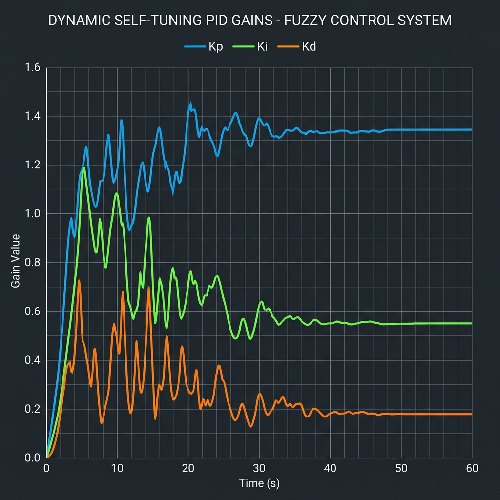
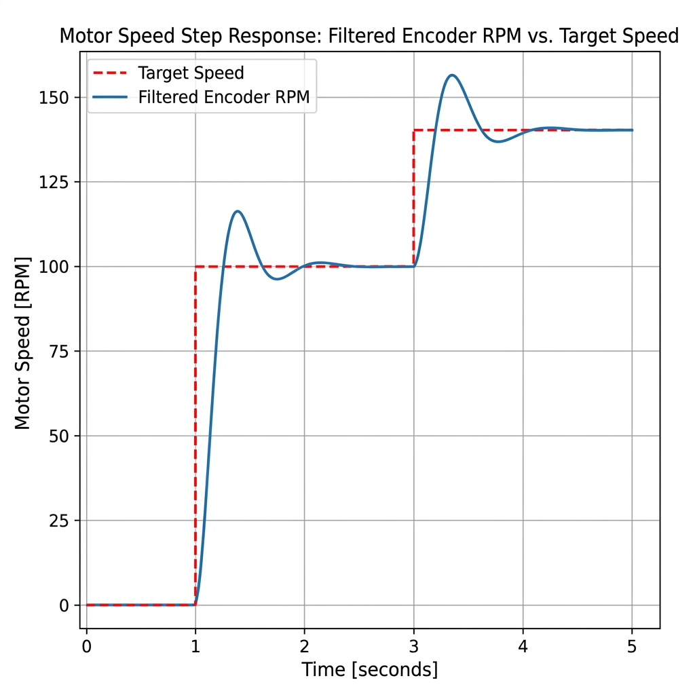
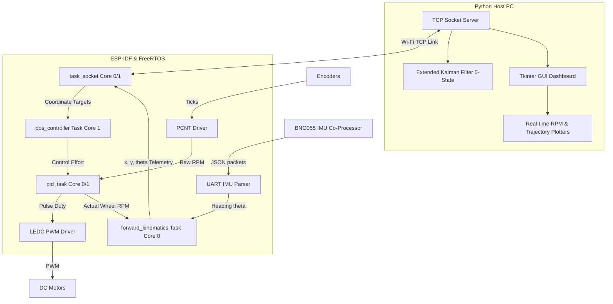

# Three-Wheel Omnidirectional Robot Control with Fuzzy‑PID Tuning

This repository contains the firmware and host-side software for a three-wheel omnidirectional mobile robot. The system implements a speed controller that dynamically adjusts motor PID parameters using a Mamdani fuzzy logic controller, runs real-time odometry and coordinate control on the ESP32, and streams telemetry via TCP sockets to a Python-based visualization server.

## Demo

* **Fuzzy-PID Parameter Tuning**:
  
* **Control Telemetry Plot**:
  
* **Video Demonstration**:

<p align="center">
  <a href="GOOGLE_DRIVE_VIDEO_URL">
    
  </a>
</p>


---

## Overview

The project is designed to control a holonomic mobile robot chassis. The platform has three omnidirectional wheels aligned at $120^\circ$ offsets. The system consists of:
1. **ESP32 Firmware**: Developed in C using the ESP-IDF framework. It manages real-time motor speed control, encoder pulse reading, coordinate-level steering, and sensor data acquisition.
2. **Host Server GUI**: Developed in Python. It provides visual plotting of wheel RPM and robot trajectories, accepts destination coordinates to send to the robot, and runs an Extended Kalman Filter (EKF) for state estimation.

---

## Key Features

* **Dual-App OTA Bootloader**: Implemented a two-partition flash layout. Partition `ota_0` runs a lightweight TCP updater that receives compiled firmware binaries; partition `ota_1` runs the primary application.
* **Fuzzy-PID Velocity Loop**: Integrates a 50 ms loop running a 49-rule Mamdani fuzzy inference engine to tune $K_p$, $K_i$, and $K_d$ parameters on the fly, compensating for friction variances and motor imbalances.
* **Asynchronous Sensor & Motor Drivers**: Utilizes the ESP32 Pulse Counter (PCNT) peripheral for quadrature encoder decoding and the LEDC peripheral for motor PWM signal generation.
* **Low-Pass Feedback Filtering**: Raw encoder RPM inputs are smoothed before being fed to the control loop using a first-order IIR Butterworth filter designed for a 20 ms sampling rate.
* **Multitasking Firmware Design**: Organizes timing critical tasks (such as the PID velocity loop and forward kinematics calculations) using FreeRTOS task prioritization and CPU core affinity.
* **Host-Side Extended Kalman Filter**: Implements a 5-state EKF ($\mathbf{x} = [x, y, \theta, v_x, v_y]^T$) on the Python server to estimate the robot's pose and velocity using filtered encoder outputs and IMU headings.

---

## System Architecture

The software architecture divides tasks between real-time control on the ESP32 and telemetry display on the host PC:



---

## Repository Owner Responsibilities

The system was evaluated and validated on physical hardware. Personal engineering responsibilities in this project included:
* **Firmware Multitasking and Architecture**: Designed the FreeRTOS task structure, configured priorities, and assigned core affinities to minimize timing jitter between the 50 ms control loops and 100 ms telemetry loops.
* **Control Loop Implementation**: Designed and implemented the Fuzzy-PID computation code, including the Mamdani fuzzification functions, the max-min inference mechanism, and center-of-gravity defuzzification.
* **Hardware Interfacing**: Configured the PCNT quadrature decoding filters and LEDC PWM channels on the ESP32; wrote the UART parser to ingest serial JSON data from the co-processed BNO055 IMU.
* **Kinematics Calculation**: Programmed the forward kinematics equations for global positioning integration and inverse kinematics for wheel speed calculations, incorporating mechanical asymmetry calibration offsets.
* **Host Server and GUI Development**: Implemented the Python socket server, the graphical dashboard in Tkinter, and coded the Extended Kalman Filter (EKF) equations to estimate robot position in real-time.

---

## Hardware and Software

| Component / Tool | Details |
| :--- | :--- |
| **Microcontroller** | ESP32-WROOM-32 DevKit |
| **IMU Sensor** | BNO055 9-axis sensor, interfaced via co-processor over UART1 |
| **Feedback / Actuators** | 3x DC motors, 1980 CPR quadrature encoders |
| **Drivers** | 3-Channel H-Bridge PWM drivers |
| **SDK & Framework** | ESP-IDF v5.x, FreeRTOS |
| **Host Stack** | Python 3.8+, NumPy, SciPy, Matplotlib, Tkinter, Pandas |

---

## Repository Structure

```
.
├── Omni/
│   ├── OTA0_FirwareUpdate/   # Slot 0 firmware: Lightweight OTA socket updater
│   │   └── main/main.c       # Downloader implementation
│   └── OTA1_Omni/            # Slot 1 firmware: Main robot control application
│       └── main/
│           ├── BNO055/       # BNO055 UART interface library
│           ├── inc/          # Header files for LPF, PID, Fuzzy, and Kinematics
│           │   ├── fuzzy_control.h
│           │   ├── omni_control.h
│           │   └── sys_config.h
│           └── src/          # Source files
│               ├── fuzzy_control.c  # Fuzzy parameter tuning routines
│               ├── omni_control.c   # Kinematic matrices
│               └── pid_handler.c    # 50ms control loop execution
└── Omni_Server/              # Host-side Python code
    ├── FuzzyPlot/
    │   └── FuzzyLog.py       # Plots logs of dynamic PID gain parameter tuning
    ├── ekf_position.py       # EKF estimator math
    ├── server.py             # TCP Server port listeners
    └── server_position.py    # Trajectory mapper and coordinate planner
```

### Suggested Starting Points
* For the control parameters tuning, see [fuzzy_control.c](Omni/OTA1_Omni/main/src/fuzzy_control.c).
* For the main velocity loop structure, see [pid_handler.c](Omni/OTA1_Omni/main/src/pid_handler.c).
* For the state estimation algorithm, see [ekf_position.py](Omni_Server/ekf_position.py).
* For system configurations and preprocessor switches, see [sys_config.h](Omni/OTA1_Omni/main/inc/sys_config.h).

---

## Results and Deployment

The robot's navigation performance was evaluated using the Python GUI trajectory mapping tool:
* **Fuzzy-PID Implementation**: Confirmed functional dynamic adjustment of $K_p \in [0.1, 5.0]$, $K_i \in [0.01, 1.0]$, and $K_d \in [0.0, 0.6]$ during physical velocity change trials.
* **Low-Pass Filter Modeling**: Verified IIR Butterworth filter implementation in smoothing raw encoder signals, reducing high-frequency speed measurement noise.
* **Kinematics Calibration**: Programmed dynamic parameter values to adjust for physical asymmetries (e.g. slight deviations in wheel radii: $r_1=0.0298$ m, $r_2=0.0281$ m, $r_3=0.0290$ m).

---

## Build and Run

### Firmware Setup
1. Configure local network SSID, password, and server target IP in [sys_config.h](Omni/OTA1_Omni/main/inc/sys_config.h).
2. Open terminal in the firmware project and build/flash using:
   ```bash
   cd Omni/OTA1_Omni
   idf.py build
   idf.py -p <PORT> flash monitor
   ```

### Host Server Setup
1. Install Python dependencies:
   ```bash
   pip install numpy scipy matplotlib pandas
   ```
2. Navigate to the server folder and run:
   ```bash
   cd Omni_Server
   python main.py
   ```
3. Start the GUI control server listener to connect to the robot client.

---

## Limitations

* **Holonomic Drift**: Omnidirectional wheels are prone to slipping, leading to cumulative dead reckoning tracking errors. Long trajectories require external landmark references to correct pose drift.
* **UART Data Overhead**: Telemetry from the BNO055 IMU is parsed from serial JSON strings, adding message processing overhead relative to direct sensor registry access.
* **TCP Network Dependencies**: Real-time control commands and telemetry updates depend on Wi-Fi link stability; network packet jitter can cause latency in feedback loops.

---

## Third-Party Components & Acknowledgements

* **ESP-IDF Core Components**: Built using the Espressif Systems SDK drivers, including the Pulse Counter (PCNT) and LEDC PWM libraries.
* **BNO055 Serial Library**: Adapted from co-processor serial communication libraries.
* **cJSON**: Used for JSON telemetry assembly and parsing.
